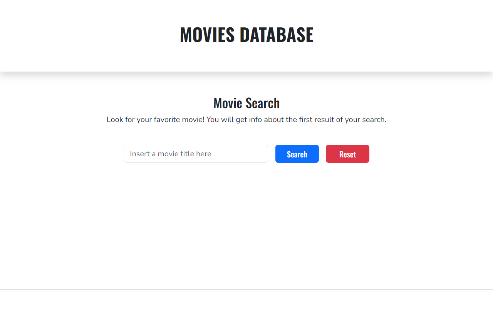
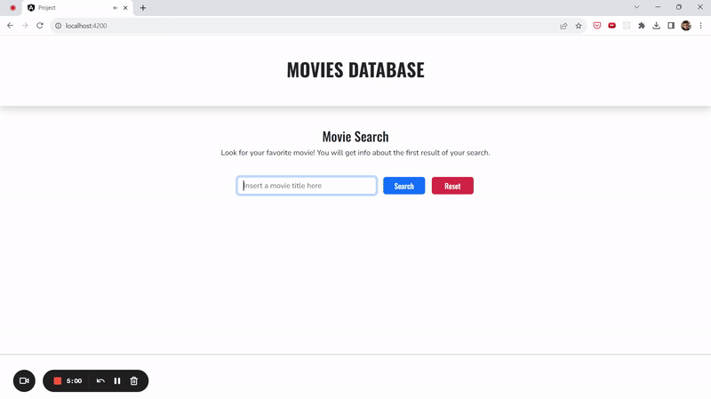
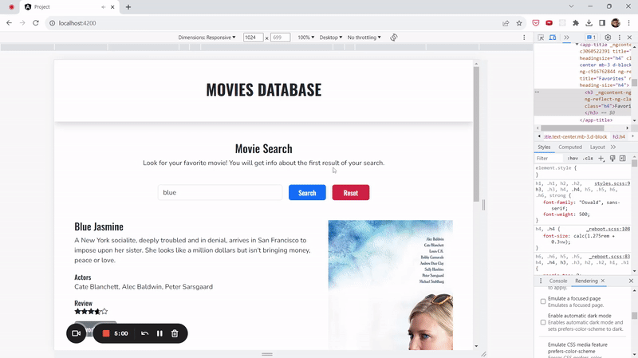

## Development

This project was generated with [Angular CLI](https://github.com/angular/angular-cli) version 16.2.0.

Stack: Angular, SCSS and Typescript

Run `ng serve` for a dev server. Navigate to `http://localhost:4200/`. The application will automatically reload if you change any of the source files.

Run `ng build` to build the project. The build artifacts will be stored in the `dist/` directory.

## Project

The objective was to create a SPA that was able to fetch movies through the Open Movie Database Api and exhibit them to the user.

### Features

#### Movie Fetching

As expected, the app is able to show information of the first movie from the api search results as the button for 'Search' is clicked, and, if the search returns no elements, an error message will appear, to give feedback to the user.

#### Favorites List 

It's possible to click on the "Favorite" button, in the movie's info block, to add it to a list, that will be available on the bottom of the page as soons as it is populated. The list also has the functionality to be cleared by clicking on the proper button

#### Dark theme

The app will search for the user's preference for themes set in the browser, adapting to the dark theme if necessary.

### Extras

#### Precise rating

A proper calculation is done to show a more precise visual of how many stars represent the movie's rating, even when it is in float numbers.

#### Loading element

A visual feedback will be provided to let the user know that their action of clicking the search button was effective.

